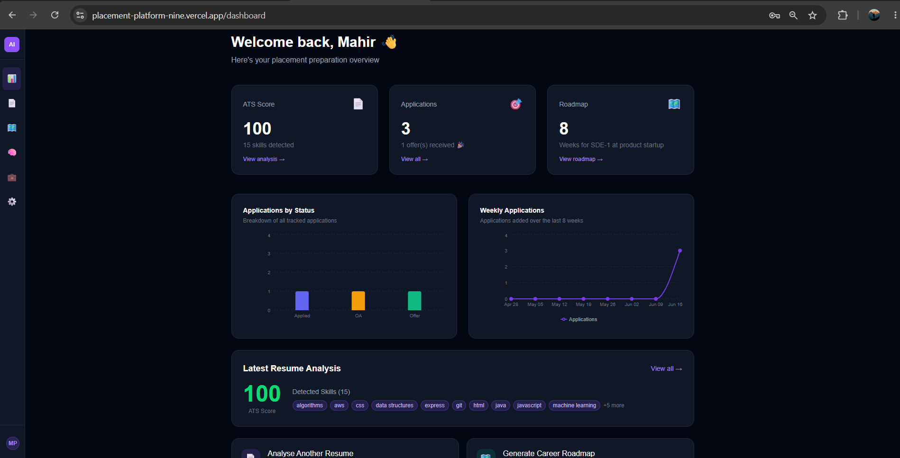
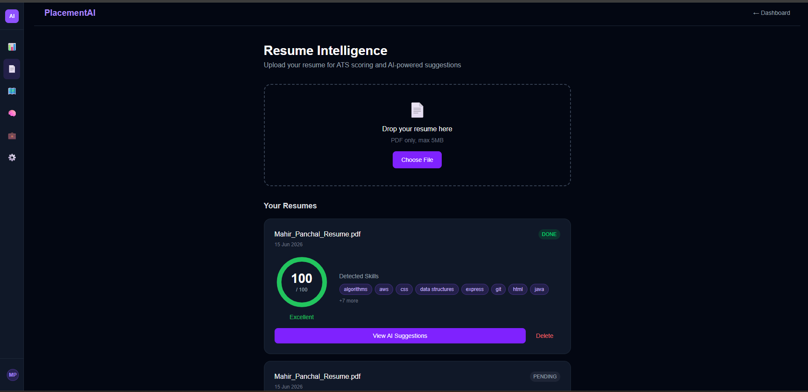
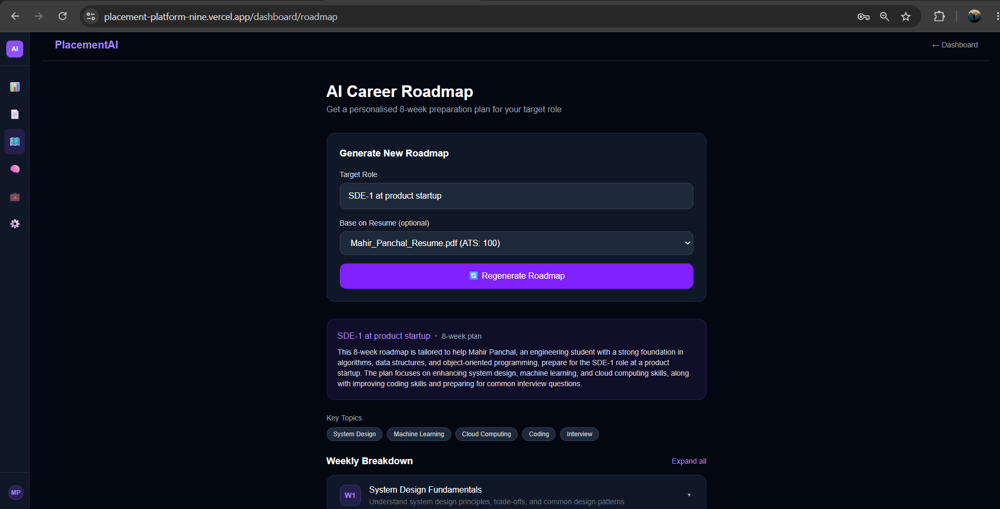
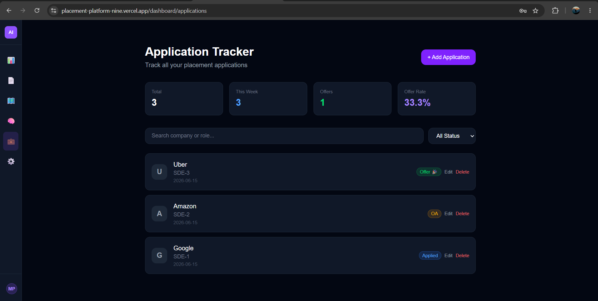

# AI Placement Intelligence Platform


## Live Demo
- **Frontend:** [placement-platform-nine.vercel.app](https://placement-platform-nine.vercel.app)
- **API Health Check:** [backend health endpoint](https://placement-backend-cq8i.onrender.com/api/health/)

An AI-powered full-stack web platform to help engineering students ace campus placements.

## Highlights

- ✅ Full-stack AI-powered placement platform
- ✅ Resume ATS analysis with LLM feedback
- ✅ RAG knowledge base using LangChain + FAISS
- ✅ JWT Authentication + Google OAuth
- ✅ Celery background jobs and email notifications
- ✅ Dockerized development environment
- ✅ GitHub Actions CI/CD pipeline
- ✅ 38 automated tests with 82% coverage

## Motivation

Engineering students often manage resumes, placement preparation resources, company applications, and progress tracking across multiple disconnected tools.

The AI Placement Intelligence Platform centralizes the entire placement journey into a single AI-assisted dashboard, helping students improve resumes, prepare for interviews, organize study materials, and track applications efficiently.

## Features

- 📄 **Resume Intelligence** — Upload PDF, get ATS score + AI improvement suggestions
- 🗺️ **Career Roadmap** — AI-generated week-by-week preparation plan for your target role
- 🧠 **RAG Knowledge Base** — Upload placement PDFs and ask questions using semantic search
- 💼 **Application Tracker** — Track job applications with status pipeline and analytics
- 📊 **Analytics Dashboard** — Charts and stats across your entire placement journey
- 🔔 **Smart Notifications** — Weekly email summaries and stale application reminders
- ⚙️ **Settings** — Profile management, password change, notification preferences

## Screenshots

<p align="center">
  
  
</p>

<p align="center">
  
  
</p>

### Dashboard
Real-time analytics, application statistics, and placement progress tracking.

### Resume Intelligence
ATS scoring and AI-powered resume improvement suggestions.

### Career Roadmap
Personalized week-by-week preparation plans for target roles.

### RAG Knowledge Base
Semantic search and question answering over uploaded placement resources.

### Application Tracker
Track job applications through a complete status pipeline with analytics.

## Known Limitations

The RAG Knowledge Base feature is fully functional in local development.

Due to Render free-tier storage and startup limitations, the embedding model and FAISS index are not persisted across deployments. As a result, the Knowledge Base feature may be unavailable or require reinitialization on the hosted demo.

To experience the complete RAG workflow, run the project locally using the setup instructions provided further.

## Tech Stack

| Layer | Technology |
|---|---|
| Backend | Django 4.2 + Django REST Framework |
| Database | PostgreSQL 15 |
| Cache / Queue | Redis 7 + Celery |
| AI / LLM | LangChain + Groq (Llama 3.1) |
| Vector Search | FAISS |
| Frontend | Next.js 14 + TypeScript + Tailwind CSS |
| Auth | JWT (SimpleJWT) + Google OAuth |
| Containerisation | Docker + Docker Compose |
| CI/CD | GitHub Actions |
| Deployment | Render (backend) + Vercel (frontend) |

## Architecture

```
[ Next.js Frontend ]
        ↕ HTTPS (JWT Bearer token)
[ Django REST API ]
  Auth · Resume · Roadmap · RAG · Tracker · Notifications
        ↕ ORM          ↕ Celery tasks       ↕ LangChain
[ PostgreSQL ]    [ Redis + Workers ]    [ FAISS Index ]
```

## Local Setup

### Prerequisites

- Docker + Docker Compose
- Node.js 18+
- Python 3.11+
- Git

### 1. Clone the repository

```bash
git clone https://github.com/Mahir-Panchal/placement-platform.git
cd placement-platform
```

### 2. Set up environment variables

```bash
cp backend/.env.example backend/.env
```

Fill in `backend/.env`:

```
SECRET_KEY=your-secret-key-here
DB_PASSWORD=postgres123
GROQ_API_KEY=your-groq-api-key
EMAIL_HOST_USER=your-gmail@gmail.com
EMAIL_HOST_PASSWORD=your-gmail-app-password
```

### 3. Start Docker (PostgreSQL + Redis)

```bash
docker-compose up
```

### 4. Set up the backend

```bash
cd backend
python -m venv venv

# Windows
venv\Scripts\Activate.ps1

# Mac/Linux
source venv/bin/activate

pip install -r requirements.txt
python manage.py migrate
python manage.py runserver
```

Backend runs at `http://localhost:8000`

### 5. Set up the frontend

```bash
cd frontend
npm install
npm run dev
```

Frontend runs at `http://localhost:3000`

## Project Structure

```
placement-platform/
├── .github/
│   └── workflows/
│       └── ci.yml              # GitHub Actions CI pipeline
├── backend/
│   ├── apps/
│   │   ├── authentication/     # JWT auth, Google OAuth, user profile
│   │   ├── resume/             # PDF parsing, ATS scoring, AI suggestions
│   │   ├── roadmap/            # AI career roadmap generation
│   │   ├── rag/                # RAG pipeline, FAISS vector search
│   │   ├── tracker/            # Job application tracker + stats
│   │   └── notifications/      # Celery Beat email notifications
│   ├── core/
│   │   ├── settings/
│   │   │   ├── base.py         # Shared settings
│   │   │   ├── dev.py          # Development settings
│   │   │   └── prod.py         # Production settings
│   │   ├── celery.py           # Celery configuration
│   │   └── urls.py             # Root URL configuration
│   ├── Procfile                # Render process definitions
│   ├── render.yaml             # Render deployment config
│   └── requirements.txt
└── frontend/
    └── src/
        └── app/
            ├── dashboard/      # Main dashboard + layout
            │   ├── applications/   # Application tracker page
            │   ├── resume/         # Resume upload + analysis
            │   ├── roadmap/        # Career roadmap page
            │   ├── knowledge/      # RAG knowledge base page
            │   └── settings/       # User settings page
            ├── login/          # Login page
            └── register/       # Registration page
```

## API Endpoints

| Method | Endpoint | Description |
|--------|----------|-------------|
| POST | `/api/auth/register/` | Register new user |
| POST | `/api/auth/login/` | Login + get JWT tokens |
| GET | `/api/auth/me/` | Get current user profile |
| PATCH | `/api/auth/me/` | Update profile |
| PATCH | `/api/auth/password/change/` | Change password |
| DELETE | `/api/auth/me/delete/` | Deactivate account |
| POST | `/api/resume/upload/` | Upload resume PDF |
| GET | `/api/resume/` | List all resumes |
| GET | `/api/roadmap/` | Get career roadmap |
| POST | `/api/roadmap/generate/` | Generate new roadmap |
| GET | `/api/rag/documents/` | List knowledge documents |
| POST | `/api/rag/documents/` | Upload knowledge document |
| POST | `/api/rag/query/` | Query the knowledge base |
| GET | `/api/tracker/` | List job applications |
| POST | `/api/tracker/` | Add job application |
| PATCH | `/api/tracker/{id}/` | Update application |
| DELETE | `/api/tracker/{id}/` | Delete application |
| GET | `/api/tracker/stats/` | Get tracker analytics |
| GET | `/api/health/` | Health check |

## Tests

```bash
cd backend
pytest --cov=apps -v
```

```
38 tests passing across 5 apps
82% coverage overall
```

Test breakdown:

```
authentication  — 10 tests
resume          — 10 tests
roadmap         —  4 tests
rag             —  4 tests
tracker         — 10 tests
```

## CI/CD Pipeline

Every push to `main` automatically:

1. Spins up PostgreSQL 15 + Redis 7
2. Installs all dependencies
3. Runs Black formatting check
4. Runs Flake8 linting
5. Runs Django system check
6. Runs all 38 tests with coverage
7. Fails if coverage drops below 70%

## Environment Variables Reference

| Variable | Description | Required |
|----------|-------------|----------|
| `SECRET_KEY` | Django secret key | Yes |
| `DB_PASSWORD` | PostgreSQL password | Yes |
| `DB_HOST` | PostgreSQL host (default: localhost) | No |
| `DB_PORT` | PostgreSQL port (default: 5432) | No |
| `GROQ_API_KEY` | Groq API key for Llama 3.1 | Yes |
| `REDIS_URL` | Redis connection URL | No |
| `EMAIL_HOST_USER` | Gmail address for notifications | No |
| `EMAIL_HOST_PASSWORD` | Gmail app password | No |
| `ALLOWED_HOSTS` | Comma-separated allowed hosts (prod) | Prod only |
| `CORS_ALLOWED_ORIGINS` | Comma-separated CORS origins (prod) | Prod only |
| `DATABASE_URL` | Full database URL (prod) | Prod only |

## Key Design Decisions

- **Groq instead of OpenAI** — Free tier, Llama 3.1 8B is sufficient for resume analysis and roadmap generation, ~80% cheaper
- **FAISS instead of Pinecone** — Local vector store avoids external API dependency in development
- **fastembed instead of sentence-transformers** — Avoids heavy PyTorch Docker build, faster cold starts
- **Redis local memory cache in dev** — Avoids Redis version incompatibility on Windows
- **JWT with refresh token blacklisting** — Secure logout, prevents token reuse after password change

## License

MIT
